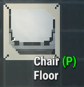
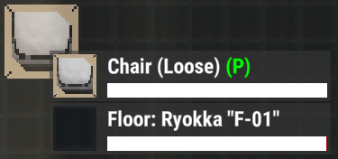
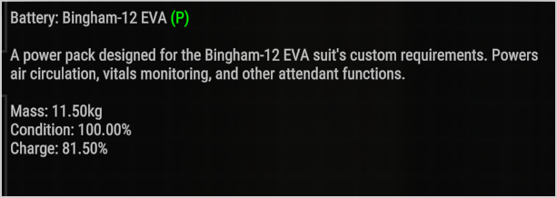

# PristineMouseover

Adds a green (P) marker to Pristine items when hovering over them in-world or in inventory.

This update improves support for Ostranauts 0.15.0.29 (64), including stacked mouseover items and inventory tooltips. Multiple Pristine objects under the cursor can now be marked at the same time, such as floors, equipment, installed objects, and loose items.

Highlights:
- Adds (P) to Pristine in-world mouseovers
- Adds (P) to Pristine inventory mouseovers
- Supports multiple Pristine objects in the same mouseover stack
- Keeps the marker out of MegaTooltip and chat/log messages
- UI-only tooltip helper for easier Pristine item identification

Tested on Ostranauts 0.15.0.29 (64).

---

## Features

* Adds `(P)` to item mouseover tooltip if item is Pristine
* Does not modify or depend on the mega tooltip
* Works automatically when hovering over items
* 
* 
* 

---

## Requirements

* [BepInExPack_Ostranauts](https://new.thunderstore.io/c/ostranauts/p/BepInEx/BepInExPack_Ostranauts)

---

## Installation

1. Install BepInEx into your Ostranauts directory
2. Place `PristineMouseover.dll` into:

   ```
   Ostranauts/BepInEx/plugins/
   ```
3. Launch the game

---

## Compatibility

* Works alongside **PristineMegaTooltip**
* May conflict with other tooltip/UI mods

---

## Related Mod

**[Pristine MegaTooltip](https://github.com/Behmused/PristineMegaTooltip)**

* Removes clutter from the mega tooltip
* Displays condition labels (Pristine, Refurbished, Like New, Worn, Used)

---

## License

MIT
